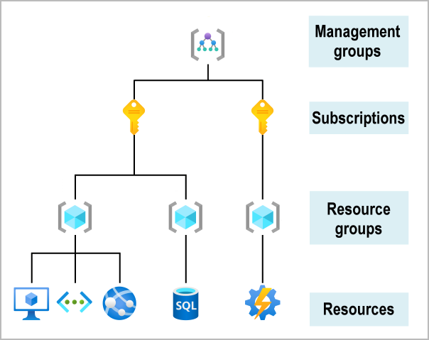

- **Resources:** Resources are instances of services that you create, like virtual machines, storage, or SQL databases.

- **Resource groups:** Resources are combined into resource groups, which act as a logical container into which Azure resources like web apps, databases, and storage accounts are deployed and managed.

- **Subscriptions:** A subscription groups together user accounts and the resources that have been created by those user accounts. For each subscription, there are limits or quotas on the amount of resources that you can create and use. Organizations can use subscriptions to manage costs and the resources that are created by users, teams, or projects.

- **Management groups:** These groups help you manage access, policy, and compliance for multiple subscriptions. All subscriptions in a management group automatically inherit the conditions applied to the management group.

 

