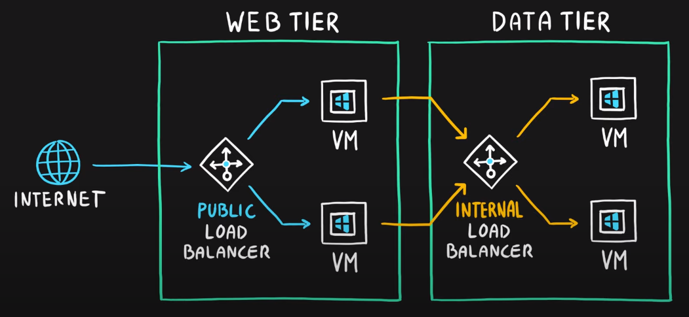

* Load Balancers provide scalability and availability by distributing network traffic between multiple VMs.

* **Scaling out** can accommodate much larger work loads compared to **scaling up** where you simply add more power.

 

* Load balancers can be deployed in tiers and supports both external and internal traffic also.  

