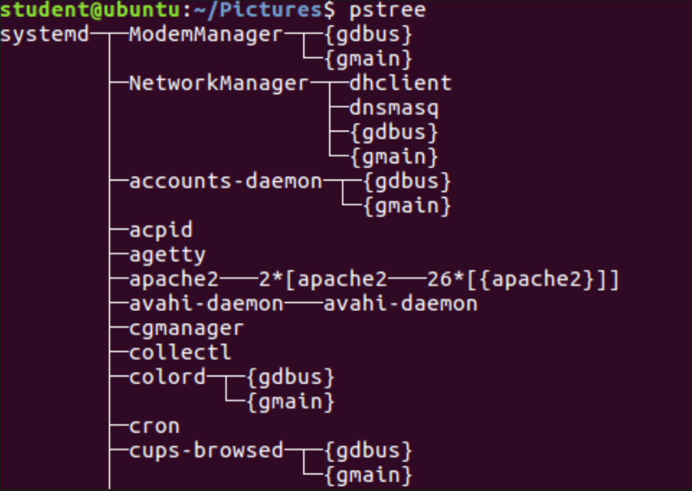

### ps
Provides information about currently running processes keyed by **PID**.

- To view all the processes in the system in full detail, use `ps -ef`.

- Use `top/htop` to get continuously updated processes status.

### pstree
-  It displays the running processes as a tree structure of parent process and sub-processes.

{float: middle}

### top config
- `A` : shorts the process list by top resource consumers.
- `k` : kill a specific process with **PID**.
- `o` : enter the top config screen.
- `f` : select a new sort order in the process list.
- `r` : change the priority of (renice) a specific process.
- `1` : get stats from each core of your cpu.

### process priority
the `nice` value or niceness for a process can be used to set priority.  
- `renice` command can be used to set priorities.
  >`renice [Nice Value] <PID\>`

  >To check for nice value of a  running process, use `ps lf`.

Nice Value:

Highest Priority | Lowest Priority |
:---:| :---: |
-20 | +19 |
