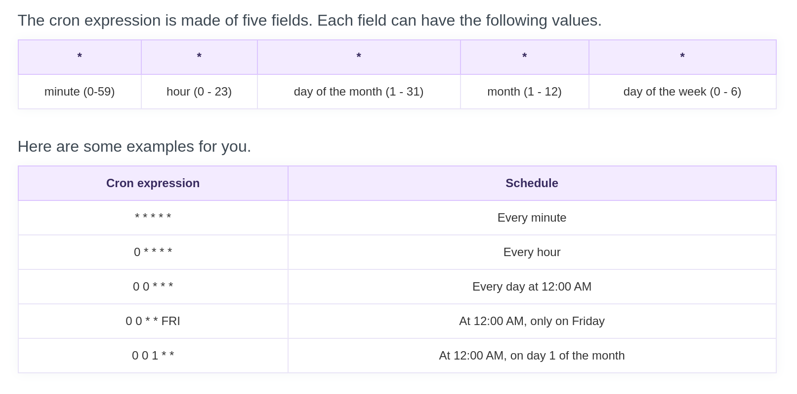

### Scheduling with at

`at` is a utility program used to execute any non-interactive at a specific time.

- to exit the `at` utility use `ctrl+d`.
- `atq` or `at -l` lists the users pending job.
- `atrm` or `at -d` deletes the jobs, identified by their job number.
  > more details at `info at`.

### Cron

Cron is used to schedule routine background jobs.

- `crontab -e` will open a crontab editor for the specified user.

- `crontab -l` will list all the scheduled jobs for that user.

crontab entry format:
> m  h  dom  mon  dow  <command\>  

here,  

Field|Desc|
:---:|---|
 m | minutes |
 h | hour |
 dom | day of month |
 mon | month |
 dow | day of week |

Crontab Generator: <https://crontab-generator.org/>

 

{float: middle}

### Sleep

Sleep suspends execution of a command or job for a specified peried of time.

> `sleep NUMBER [SUFFIX]...`

Suffix can be
- **s** for seconds (default)
- **m** for minutes
- **h** for hours
- **d** for days
